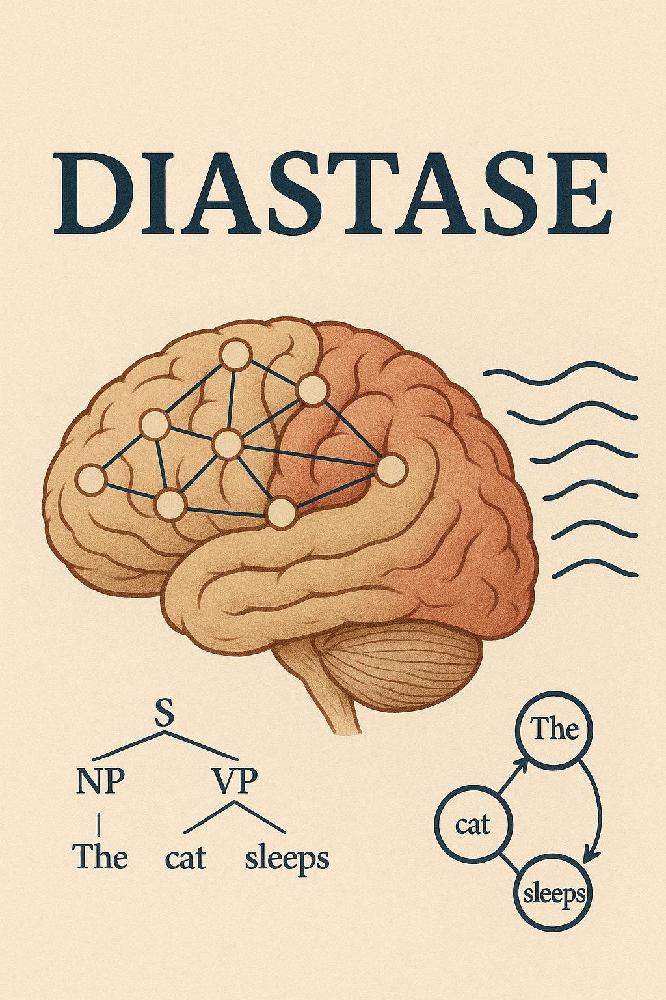

# DIASTASE (die-as-tase - Διάσταση)
*D*isentangling h*I*erarchical *A*nd *S*equen*T*i*A*l *S*entence proc*E*ssing
<p align="center">
  
</p>

# DIASTASE Project: Exploring Hierarchical vs. Sequential Processing in Language

DIASTASE is a comprehensive multidisciplinary research project investigating the neural mechanisms underlying language comprehension through a combination of behavioral experiments, neuroimaging (MEG/EEG), and computational modeling. This project tackles a fundamental question in cognitive neuroscience: Does the brain process language using primarily hierarchical structure-building operations, sequential word-by-word prediction, or both systems in parallel? By analyzing patterns of grammatical errors, neural signatures of language processing, and computational LSTM models that simulate both types of processing, we aim to disentangle these potentially competing mechanisms. The project incorporates rigorously controlled linguistic stimuli, neuroimaging (MEG/EEG) data collection with advanced preprocessing pipelines, behavioral error-rate analysis, and computational modeling.  This repository contains the complete implementation across all project components, from stimulus creation to final data analysis.

## Table of Contents
- [Project Overview](#project-overview)
- [Environment Setup](#environment-setup)
- [Repository Structure](#repository-structure)
- [Components](#components)
  - [Behavioral Analysis](#behavioral-analysis)
  - [Neural Data Analysis](#neural-data-analysis)
  - [Experiment Implementation](#experiment-implementation)
  - [Stimulus Creation](#stimulus-creation)
  - [Computational Modeling](#computational-modeling)

  

## Code and Data Availability

All code for this project is available in this repository, providing a complete implementation of the experimental paradigm, analysis pipelines, and modeling components.

### Data Access

The neuroimaging (MEG/EEG) and behavioral data for this project are publicly available through the Open Science Framework (OSF) repository:

- **OSF Repository**: [MEG, EEG and Behavioral Data for: 'Disentangling Hierarchical and Sequential Computations during Sentence Processing'](https://osf.io/yabqg/?view_only=b1166cea622c463eb46f8efb26a87197)
- **Data Size**: 50.7GB


This repository contains:
- Raw MEG/EEG recordings
- Preprocessed epoch files (cropped around the target onset)
- Behavioral response data
- Subject metadata

Researchers interested in using or analyzing this data are encouraged to reference the original publication and cite the dataset using the DOI provided in the OSF repository.

### Citation

When using this code or data, please cite the following:

```bibtex
@article{zacharopoulos2022disentangling,
  title={Disentangling Hierarchical and Sequential Computations during Sentence Processing},
  author={Zacharopoulos, Christos-Nikolaos and Dehaene, Stanislas and Lakretz, Yair},
  journal={bioRxiv},
  pages={2022--07},
  year={2022},
  publisher={Cold Spring Harbor Laboratory}
}
```

## Project Overview

Language is a complex cognitive function fundamental to human communication. Sentences in natural languages exhibit a hierarchical structure, often represented by linguists as nested trees. Understanding sentence meaning requires the human brain to construct these complex syntactic structures while receiving the words sequentially. Alongside this hierarchical processing mechanism, there may exist a simpler, linear form of processing that handles word-by-word sequences. This sequential processing is thought to be evolutionarily older and may potentially interfere with the more complex hierarchical structure processing, leading to errors in sentence comprehension.

The DIASTASE project explores this concept further by examining whether these two processing types - hierarchical and sequential - coexist and how they interact. The project aims to dissect whether sentence-processing errors stem from working memory interference between words or from conflicting local versus long-distance word prediction signals.

## Environment Setup

This project uses Conda for environment management. To set up the development environment:

1. Make sure you have Anaconda or Miniconda installed on your system.

2. Clone this repository:
   ```bash
   git clone [repository-url]
   cd DIASTASE
   ```

3. Create the conda environment from the provided YAML file:
   ```bash
   conda env create -f DIASTASE.yml
   ```

4. Activate the environment:
   ```bash
   conda activate DIASTASE
   ```

The environment includes essential packages for data analysis and visualization:
- Scientific computing: NumPy, SciPy, Pandas
- Visualization: Matplotlib, Seaborn
- Neural data analysis: MNE, scikit-learn
- Neurophysiology data formats: pynwb, nwbwidgets
- Development tools: Spyder IDE (optional)

## Repository Structure

The project's source code is organized into several key components under the `src` directory:

- **behavioral/**: Contains the behavioral analysis code, focusing on error-rate analysis of the experimental data.

- **comp_model/**: Houses the LSTM decoding analysis implementation, used for computational modeling of language processing.

- **neural_data_analysis/**: Contains the complete pipeline for analyzing MEG and EEG signals, from preprocessing to neural decoding.

- **run_experiment/**: Includes the PsychToolbox code used for stimulus presentation and experimental control.

- **stimulus_creation/**: Contains the code used to generate and prepare the stimuli used in the experiments.

## Behavioral Analysis

The behavioral analysis component (`src/behavioral/`) processes and analyzes participants' responses. Only the error-rate is analyzed but we also provide information on the reaction times.

### Key Components

1. **Error Rate Calculation** (`calculate_error_rate.py`)
   - Processes raw behavioral responses
   - Calculates error rates across different experimental conditions
   - Features:
     - Condition-wise analysis (grammatical/violation)
     - Congruency analysis (congruent/incongruent)
     - Structure-specific analysis (PP/ObjRC)
     - Feature-specific analysis (number/animacy)

2. **Statistical Analysis** (`run_stats.py`)
   - Performs detailed statistical analyses on error rates
   - Creates visualization plots
   - Key analyses:
     - ANOVA tests for main effects and interactions
     - Error rate calculations with standard error
     - Interaction plots for different experimental conditions

### Data Structure

The analysis expects behavioral data with the following key variables:
- `condition`: Experimental condition (GSLS, GSLD, GDLS, GDLD)
- `structure`: Sentence structure (PP/ObjRC)
- `feature`: Linguistic feature (number/animacy)
- `violation`: Presence of violation (yes/no)
- `congruency`: Congruency status (yes/no)
- `response`: Participant's response (correct/false)

### Running the Analysis

1. **Calculate Error Rates**:
   ```bash
   python src/behavioral/calculate_error_rate_new.py
   ```
   This generates a `data.csv` file containing processed error rates.

2. **Run Statistical Analysis**:
   ```bash
   python src/behavioral/run_stats.py
   ```
   This produces:
   - Statistical test results (ANOVA)
   - Interaction plots (`main_effects.png`)
   - Summary statistics for each condition

### Output

The analysis generates several key outputs:
1. **Error Rate Data** (`data.csv`):
   - Per-subject error rates
   - Condition-specific metrics
   - Trial-level information

2. **Visualization** (`main_effects.png`):
   - Three-panel plot showing:
     - PP-Number effects
     - ObjRC-Number effects
     - PP-Animacy effects
   - Error bars indicating standard error
   - Interaction lines between conditions

3. **Statistical Results**:
   - ANOVA results for:
     - Main effects of violation
     - Main effects of congruency
     - Interaction effects
   - Summary statistics (means ± SEM)

## Neural Data Analysis Pipeline

The neural data analysis pipeline (`src/neural_data_analysis/`) provides a comprehensive framework for processing and analyzing MEG/EEG data from the DIASTASE experiments.

### Quick Start

1. **Set Up Configuration**:
   - Open `src/neural_data_analysis/config.py`
   - Set the `root` directory path:
     ```python
     root = os.path.join(
         os.sep,
         "path",
         "to",
         "your",
         "storage",
     )
     ```
   - All other directories will be automatically created and managed

2. **Pipeline Structure**:
   ```
   00: Data Quality Check
   01: Preprocessing
   02: Epoching
   03: Signal Space Projection
   ```

### Pipeline Components

1. **Data Quality Checks** (00_*)
   - `00_a-check_triggers.py`: Verify experimental triggers
   - `00_b-detect_deviant_sensors.py`: Identify problematic sensors

2. **Preprocessing** (01_*)
   - `01_a-basic_preprocessing.py`: Initial data cleaning
   - `01_b-apply_maxwell_filter_*.py`: Maxwell filtering (site-specific)
   - `01_c-advanced_preprocessing.py`: Advanced artifact removal

3. **Epoching** (02_*)
   - `02_a-make_epochs.py`: Create trial epochs

4. **Signal Space Projection** (03_*)
   - `03_a-run_ssp.py`: Calculate SSP vectors
   - `03_b-apply_ssp.py`: Apply SSP correction

5. **Effects Analysis**
   - `first_order_effects.py`: Primary experimental effects
   - `second_order_effects.py`: Interaction effects
   - `third_order_effects.py`: Complex interactions

### Configuration Parameters

Key parameters in `config.py`:
- Processing flags (Maxwell filter, SSP, ICA)
- Experimental constructions
- Rejection thresholds
- Channel configurations
- Frequency filtering parameters
- Epoching parameters
- Subject lists

### Processing Options

The pipeline supports multiple processing paths:
- Maxwell filtering for MEG data
- SSP or ICA for artifact removal (mutually exclusive)
- Automatic and manual bad channel rejection
- Flexible frequency filtering
- Customizable epoch definitions

### Output Structure

The pipeline automatically organizes outputs in:
- `/data`: Raw and processed data
- `/figures`: Analysis visualizations
- `/output`: Processing results
- `/calibration_files`: System calibration data

### Requirements

- MNE-Python
- NumPy
- Custom repositories (`repos/`)
  - `func_repo`: Utility functions
  - `class_repo`: Path management

### Notes

- Set `plot=True` in config.py for visual inspection
- Use `N_JOBS=-1` for parallel processing
- Site-specific Maxwell filter scripts available
- Automatic directory creation and management

## Experiment Implementation

The experiment implementation (`src/run_experiment/`) contains the MATLAB/Psychtoolbox code for running the DIASTASE behavioral and MEG/EEG experiments. This implementation handles stimulus presentation, response collection, and synchronization with neuroimaging equipment.

### Prerequisites
- MATLAB (tested on R2019b+)
- Psychtoolbox-3
- Data Acquisition Toolbox (for TTL triggers)
- Compatible display and response devices

### Quick Start
1. Navigate to the experiment directory:
   ```matlab
   cd src/run_experiment/Code
   runLocalGlobalParadigm
   ```
2. Follow the prompts to configure:
   - Training block inclusion
   - TTL trigger activation
   - Subject and session information

### Core Components
1. **Experiment Configuration** (`getParamsLocalGlobalParadigm.m`)
   - Timing parameters (SOA, response windows)
   - Display settings (screen, colors)
   - Response mappings
   - File paths and trigger codes

2. **Stimulus Presentation** (`run_visual_block.m`)
   - Precise timing control
   - Trial randomization
   - Response collection
   - MEG/EEG trigger synchronization

3. **Training Module** (`run_training_block.m`)
   - Practice trials with feedback
   - Adjustable difficulty levels
   - Performance monitoring

4. **Data Logging** (`createLogFileLocalGlobalParadigm.m`)
   - Trial-by-trial responses
   - Timing information
   - Experimental conditions
   - Error tracking

### Hardware Integration
1. **Display Setup**
   - Screen initialization and calibration
   - Timing synchronization
   - Color and luminance control

2. **TTL Triggers**
   - Support for multiple systems (Neurospin MEG, Houston EEG)
   - Configurable ports and timing
   - Trigger verification system

### Experimental Design
1. **Block Structure**
   - Optional training phase
   - Multiple experimental blocks
   - Randomized trial sequences
   - Controlled break periods

2. **Trial Sequence**
   - Fixation presentation
   - Stimulus display
   - Response collection
   - Inter-trial interval

### Data Output
The experiment generates detailed log files containing:
- Trial-level information
- Response accuracy and timing
- Experimental conditions
- MEG/EEG synchronization timestamps

Example log format:

Trial  Condition  Response  RT  Accuracy  Timestamp
1      GSLS      1         0.543  1      12345.678

### Debug Mode
Enable debug mode for development:
```matlab
debug_mode = 1;
```

Features:
- Error breakpoints
- Timing verification
- Trigger testing
- Display position checks

### Important Notes
1. **System Requirements**
   - Display refresh rate: minimum 60 Hz
   - Response device latency < 1ms
   - Stable TTL connection
   - Sufficient RAM for stimulus loading

2. **Pre-experiment Checklist**
   - Screen gamma correction
   - Response device testing
   - TTL timing verification
   - MEG/EEG synchronization check
   - Participant instructions prepared

3. **During Experiment**
   - Monitor participant performance
   - Check trigger reception
   - Maintain regular log backups
   - Record any unusual events

### Troubleshooting
1. **Timing Issues**
   - Verify screen refresh rate
   - Check PTB synchronization
   - Monitor system load
   - Close unnecessary applications

2. **Trigger Problems**
   - Check hardware connections
   - Verify port configurations
   - Test trigger reception
   - Confirm DAQ toolbox settings

3. **Display Issues**
   - Update graphics drivers
   - Verify PTB installation
   - Check screen settings
   - Test for timing skips

## Stimulus Creation

The stimulus creation module (`src/stimulus_creation/`) provides a systematic framework for generating controlled experimental stimuli. This module ensures balanced and well-controlled sentence stimuli across different experimental conditions.

### Prerequisites
- Python 3.6+
- pandas
- numpy
- Word frequency lists (provided in Sources/)

### Quick Start
1. Generate stimuli:
   ```python
   from random_stim_generator import gen_sent
   from lexicon import construct_lexicon
   
   # Create lexicon
   words = construct_lexicon(root_path="path/to/sources")
   
   # Generate sentences
   sentences = gen_sent(
       condition="GSLS",  # Globally Standard Locally Standard (e.g, no conflicting short range or long range signals)
       words=words,
       embedding="pp",    # prepositional phrase
       stim_type="syntax",
       number="sing",     # singular
       pair_id="random",
       N=10              # number of sentences
   )
   ```

### Core Components

1. **Lexicon Construction** (`lexicon.py`)
   - Hierarchical vocabulary organization
   - Word frequency information
   - Parts of speech categorization:
     - Nouns (animate/inanimate)
     - Verbs (transitive/intransitive)
     - Prepositions
     - Determiners

2. **Stimulus Generator** (`random_stim_generator.py`)
   - Condition-based sentence generation
   - Grammatical feature control
   - Semantic feature control
   - Trial balancing

3. **Method-specific Generation** (`generator_per_method.py`)
   - Construction-specific rules
   - Feature manipulation
   - Constraint satisfaction

### Stimulus Features

1. **Syntactic Manipulations**
   - Number agreement
   - Structural complexity
   - Embedding types:
     - Prepositional phrases (PP)
     - Object relative clauses (ObjRC)

2. **Semantic Manipulations**
   - Animacy contrasts
   - Semantic congruency
   - Selectional restrictions

3. **Control Features**
   - Word frequency
   - Word length
   - Sentence length
   - Structural complexity

### Condition Types

1. **Grammaticality Conditions**
   - GSLS: Global Standard Local Standard
   - GSLD: Global Standard Local Deviant
   - GDLS: Global Deviant Local Standard
   - GDLD: Global Deviant Local Deviant

2. **Structure Types**
   - PP: Prepositional Phrases
   - ObjRC: Object Relative Clauses

3. **Feature Types**
   - Number (syntax)
   - Animacy (semantics)

### Output Format

The generator produces structured DataFrame output:
```python
{
    'pair_index': int,      # Stimulus pair identifier
    'condition': str,       # Experimental condition
    'sentence': str,        # Complete sentence
    'violIndex': int,       # Violation presence
    'n1': str,             # First noun
    'pp': str,             # Preposition/complementizer
    'n2': str,             # Second noun
    'v1': str,             # Main verb
    'v2': str,             # Secondary verb
    'frequencies': dict,    # Word frequencies
    'lengths': dict,        # Word lengths
    'violation_type': str   # Type of violation
}
```

### Important Notes

1. **Lexical Controls**
   - Frequency-matched words
   - Length-controlled items
   - Balanced animacy features
   - Controlled syntactic complexity

2. **Experimental Design**
   - Balanced condition numbers
   - Counterbalanced features
   - Controlled repetitions
   - Pseudo-randomized presentation

3. **Usage Guidelines**
   - Check frequency distributions
   - Verify feature balancing
   - Monitor condition counts
   - Validate output format

### Troubleshooting

1. **Lexicon Issues**
   - Verify word list paths
   - Check frequency file format
   - Validate category assignments

2. **Generation Problems**
   - Monitor condition balance
   - Check constraint satisfaction
   - Verify feature distribution
   - Validate output structure


## Computational Modeling

The computational modeling component (`src/comp_model/`) implements LSTM-based language models to simulate and analyze the different aspects of language processing hypothesized in the DIASTASE project. This component aims to disentangle hierarchical and sequential sentence processing mechanisms by analyzing neural network behavior.

### Key Features

1. **LSTM Language Modeling** (`word_language_model/`)
   - Pre-trained language models for predicting word sequences
   - Support for multiple model architectures (LSTM, GRU, RNN)
   - Customizable hyperparameters (embedding size, hidden layers, dropout)
   - Evaluation metrics including perplexity and prediction accuracy

2. **Activation Extraction** (`extract-activations.py`)
   - Extracts internal representations from LSTM models
   - Captures gate activations (input, forget, output gates)
   - Stores hidden and cell states for analysis
   - Processes experimental stimuli to generate model responses

3. **Short-Range vs Long-Range Processing** (`sr_lr/`)
   - Identifies specialized units for different processing types:
     - Short-Range (SR) units: handling local dependencies
     - Long-Range (LR) units: handling hierarchical structure
   - Quantifies contribution of different processing mechanisms
   - Visualizes competition between SR and LR processing

4. **Neural Decoding Analysis** (`decoding.py`)
   - Implements classification models to decode linguistic features
   - Uses Generalization Across Time (GAT) analysis
   - Compares model behavior with neural and behavioral data
   - Identifies processing patterns similar to human comprehension

### Running the Analysis

1. **Extract LSTM Activations**:
   ```bash
   python src/comp_model/extract-activations.py --model models/hidden650_batch128_dropout0.2_lr20.0.pt --stimuli data/stimuli/stimuli.csv
   ```

2. **Analyze SR/LR Competition**:
   ```bash
   python src/comp_model/sr_lr_competition.py --path2stimuli data/stimuli/stimuli.csv
   ```

3. **Run Decoding Analysis**:
   ```bash
   python src/comp_model/decoding.py --model models/hidden650_batch128_dropout0.2_lr20.0.pt --var-type hidden
   ```


### Output

The analysis generates several key outputs:

1. **Activation Data**:
   - Hidden and cell state activations for experimental stimuli
   - Gate activations showing internal processing dynamics
   - Word prediction probabilities and surprisal values

2. **Visualization**:
   - SR/LR competition plots for different structures and violations
   - Generalization Across Time heatmaps
   - Processing dynamics throughout sentence comprehension


